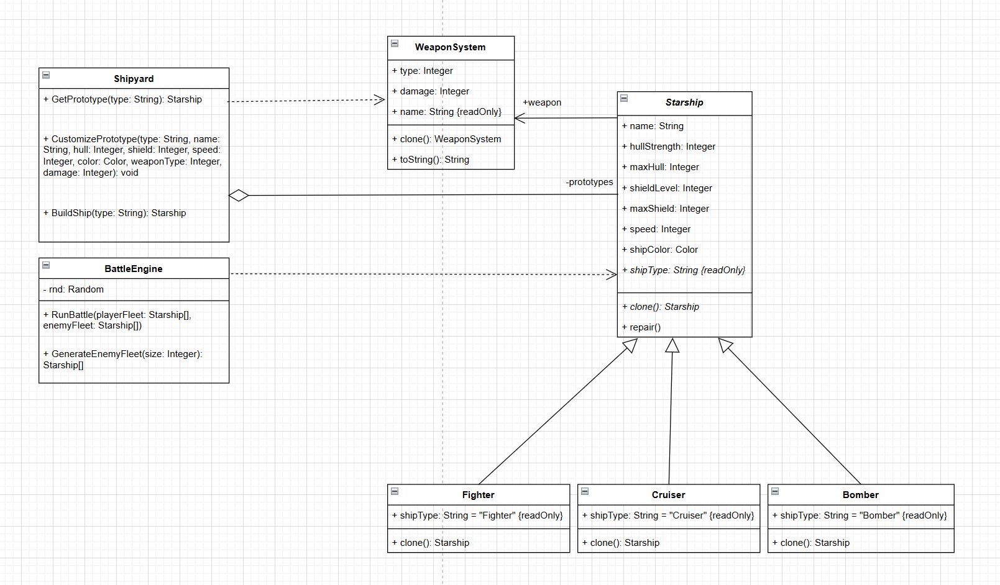

# Лабораторная работа №1 — Паттерн Прототип (Prototype)

## 1. Описание проблемы предметной области

Приложение «Строитель Флота» — конструктор космических кораблей с пошаговой боевой системой. Пользователь настраивает характеристики корабля (корпус, щит, скорость, цвет, оружие) и формирует флот из нескольких копий.

**Проблема без паттерна:**

При создании кораблей без паттерна Прототип возникают следующие трудности:

1. **Дублирование кода** — при создании нескольких одинаковых кораблей одни и те же параметры повторяются в каждом вызове конструктора.
2. **Жёсткая привязка к конкретным классам** — клиентский код должен знать, какой именно класс (`Fighter`, `Cruiser`, `Bomber`) создавать, и использовать `switch`/`if` для выбора конструктора.
3. **Отсутствие шаблона** — нет возможности настроить образец один раз и штамповать копии.
4. **Сложность расширения** — при добавлении нового типа корабля нужно менять код (добавлять ветку в `switch`). А также при добавлении новых параметров нужно будет их добавить в каждый вызов конструктора. 

Реализация без паттерна представлена в файле `ShipyardManual.cs` Можно подставить вместо `Shipyard` в `Form1.cs`.

## 2. Решение: применение паттерна Прототип

### Структура паттерна

```
Starship (абстрактный класс — Прототип)
  ├── Fighter   (Конкретный прототип)
  ├── Cruiser   (Конкретный прототип)
  └── Bomber    (Конкретный прототип)
```

### Участники

| Участник | Класс в проекте | Роль |
|---|---|---|
| Prototype | `Starship` | Абстрактный класс, объявляет метод `Clone()` |
| ConcretePrototype | `Fighter`, `Cruiser`, `Bomber` | Реализуют `Clone()`, возвращая глубокую копию |
| Client | `Shipyard` | Хранит прототипы и создаёт корабли через `Clone()` |

### Ключевые классы

- **Starship** — абстрактный прототип. Хранит характеристики (hull, shield, speed, color) и содержит связь с `WeaponSystem` (композиция). Объявляет абстрактный метод `Clone()`.
- **Fighter / Cruiser / Bomber** — конкретные прототипы. Каждый переопределяет `Clone()`, создавая независимый экземпляр своего типа с глубокой копией `WeaponSystem`.
- **WeaponSystem** — система вооружения (тип, урон). Реализует собственный `Clone()` для глубокого копирования.
- **Shipyard** — клиент паттерна. Хранит словарь `Dictionary<string, Starship>` прототипов-образцов. Метод `BuildShip()` вызывает `Clone()` на прототипе.
- **ShipyardManual** — альтернативная реализация **без** паттерна для сравнения. Использует `switch` и прямые вызовы конструкторов.
- **BattleEngine** — движок пошагового боя. Использует async callback'и для обновления UI в реальном времени.

### Суть паттерна в коде

```csharp
// Shipyard — клиент паттерна:
var shipyard = new Shipyard();                          // Верфь хранит прототипы

// Настраиваем прототип перед клонированием:
shipyard.CustomizePrototype("Fighter",
    name: "Alpha", hull: 80, shield: 40, speed: 200,
    color: Color.Red, weaponType: WeaponType.LaserCannon, damage: 30);

// Создаём корабль — клонируем настроенный прототип:
Starship ship = shipyard.BuildShip("Fighter");          // Clone() внутри
// ship — независимая глубокая копия, прототип не затронут
```

### Код без паттерна

Файл `ShipyardManual.cs` содержит альтернативную реализацию с тем же интерфейсом, что и `Shipyard`. Отличие — метод `BuildShip()` вместо `Clone()` использует `switch` по типу и вызывает конструктор напрямую. Можно заменить `new Shipyard()` на `new ShipyardManual()` в `Form1.cs` и программа будет работать, но без преимуществ паттерна.

## 3. Диаграмма классов

Диаграмма классов представлена в файле `umlships.drawio`.


## 4. Вывод

Внедрение паттерна Прототип дало следующие результаты:

1. **Устранено дублирование** — настройки задаются один раз на прототипе, а `BuildShip()` создаёт копии через `Clone()` без повторной передачи параметров.
2. **Глубокое копирование** — `Clone()` в каждом подклассе вызывает `Weapon.Clone()`, создавая независимую копию ссылочного типа `WeaponSystem`. Изменение оружия у клона не затрагивает оригинал.
3. **Простота расширения** — для добавления нового типа корабля достаточно создать класс-наследник `Starship` с реализацией `Clone()` и зарегистрировать его в словаре `Shipyard`.