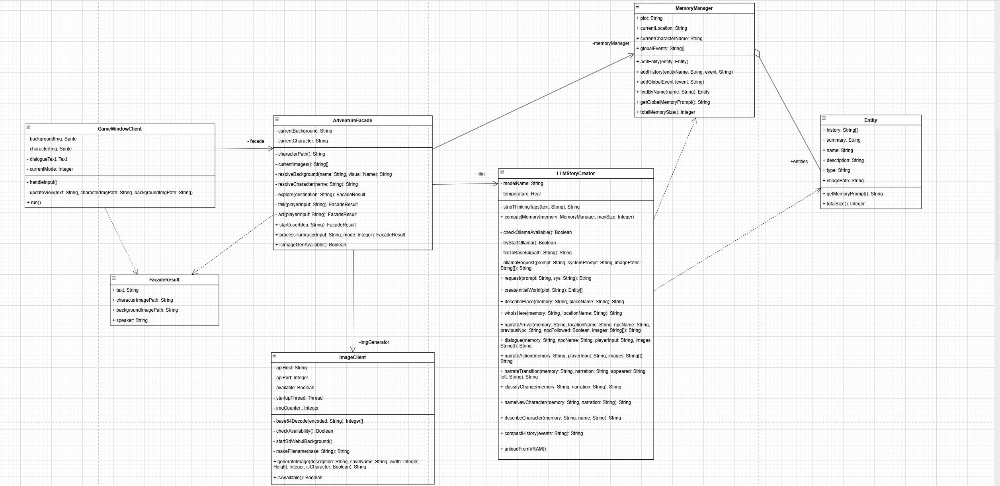

# Лабораторная работа №2: Паттерн Фасад

## Предметная область

Визуальная новелла, где история и изображения создается с помощью моделей искусственного интеллекта. Приложение представляет собой интерактивную историю, где игрок вводит свои действия текстом, а система генерирует:
- **Текст истории** — через языковую модель (Ollama, qwen3.5:4b)
- **Изображения** фонов и персонажей — через модель генерации изображений (sd-webui-forge-neo, z_image_turbo)

А также сохраняет: 
- **Состояние мира** — сюжет, персонажи, локации

### Проблема

Система состоит из трёх независимых подсистем, каждая со своим API:

1. **LLMStoryCreator** — обёртка над REST API Ollama (порт 11434). Отвечает за генерацию текста: сюжет, нарратив, диалоги, классификацию действий. Требует управления контекстным окном (num_ctx), температурой генерации, выгрузкой модели из видеопамяти.

2. **ImageClient** — обёртка над REST API sd-webui (порт 7861). Генерирует фоновые изображения (768x768) и портреты персонажей (512x768). Требует фонового запуска сервера, проверки доступности, кодирования/декодирования base64.

3. **MemoryManager** — хранилище всего игрового состояния: сюжет, коллекция сущностей (Entity), текущая локация и персонаж, глобальные события. Предоставляет нечёткий поиск и формирует полный контекст для языковой модели.

Без паттерна клиентский код (графический интерфейс) вынужден:
- Знать API всех трёх подсистем
- Управлять порядком вызовов (сначала LLM, потом выгрузка из VRAM, потом генерация изображений)
- Координировать обмен данными между подсистемами (результат LLM -> описание для ImageClient -> путь к изображению -> MemoryManager)
- Обрабатывать кэширование изображений, сжатие памяти, определение присутствия NPC в локации

Все подсистемы реализуются в клиенте (всё в одном классе), что делает их использование и изменение логики проблематичным. 

## Решение: паттерн Фасад

**Фасад** (Facade) предоставляет унифицированный интерфейс вместо набора интерфейсов подсистемы. Определяет интерфейс более высокого уровня, который упрощает использование подсистемы.

В проекте фасадом является класс **AdventureFacade**, который предоставляет клиенту (GameWindowClient) два метода:
- `start(userIdea)` — инициализация игрового мира
- `processTurn(userInput, mode)` — обработка хода игрока

Клиент не знает о существовании LLMStoryCreator, ImageClient и MemoryManager. Он отправляет текст и получает готовый результат (FacadeResult): текст для отображения, путь к фоновому изображению, путь к изображению персонажа, имя говорящего.

### Три режима игры

Игрок переключает режимы клавишей Tab:
- **EXPLORE** — перемещение по локациям. Фасад координирует: описание места (LLM) -> генерация фона (ImageClient) -> определение NPC в локации (LLM) -> генерация портрета (ImageClient) -> нарратив прибытия (LLM)
- **TALK** — диалог с текущим NPC. Фасад вызывает LLM для генерации прямой речи и записывает историю в MemoryManager
- **ACT** — действие игрока. Фасад координирует: нарратив (LLM) -> классификация изменений (LLM) -> при необходимости генерация нового персонажа (LLM + ImageClient) -> запись событий (MemoryManager)

### Координация VRAM

Одна из задач фасада — управление видеопамятью. Языковая модель и генератор изображений не могут работать одновременно (8 ГБ VRAM). Фасад обеспечивает последовательность: все вызовы LLM -> выгрузка LLM из VRAM -> генерация изображений -> LLM перезагружается при следующем запросе.

## Диаграмма классов



Основные связи:
- **GameWindowClient -> AdventureFacade** — ассоциация. Клиент видит только фасад.
- **AdventureFacade -> LLMStoryCreator** — ассоциация (-llm). Фасад координирует вызовы к LLM.
- **AdventureFacade -> ImageClient** — ассоциация (-imgGenerator). Фасад координирует генерацию изображений.
- **AdventureFacade -> MemoryManager** — ассоциация (-memoryManager). Фасад управляет состоянием мира.
- **MemoryManager ◇ Entity** — агрегация (+entities). MemoryManager хранит коллекцию сущностей.
- **AdventureFacade ---> FacadeResult** — зависимость (пунктир). Фасад возвращает результат клиенту.
- **LLMStoryCreator ---> Entity** — зависимость. LLM создаёт и использует сущности.
- **LLMStoryCreator ---> MemoryManager** — зависимость. LLM сжимает память.

## Два варианта реализации

Проект содержит две полноценные реализации с идентичной функциональностью:

### С паттерном Фасад (Source.cpp -> GameWindowClient.h)
```
GameWindowClient
    └─ AdventureFacade          ← единственная зависимость клиента
         ├─ LLMStoryCreator
         ├─ ImageClient
         └─ MemoryManager
```
Клиент вызывает только `facade.start()` и `facade.processTurn()`. Вся координация скрыта.

### Без паттерна Фасад (NoFacadeMain.cpp -> GameWindowClientNoFacade.h)
```
GameWindowClientNoFacade
    ├─ LLMStoryCreator          ← клиент знает о каждой подсистеме
    ├─ ImageClient
    └─ MemoryManager
```
Клиент сам координирует все вызовы: порядок, VRAM, кэширование, события. Тот же результат, но код клиента значительно сложнее.

Переключение между версиями: в файле `novelllama.vcxproj` изменить `ExcludedFromBuild` для `Source.cpp` и `NoFacadeMain.cpp`.

## Файлы проекта

| Файл | Назначение |
|------|-----------|
| Entity.h | Сущность игрового мира (локация или NPC) |
| MemoryManager.h | Хранилище состояния: сюжет, сущности, события |
| LLMStoryCreator.h | Обёртка над Ollama API: создание сюжета с помощью LLM, генерация текста, классификация |
| ImageClient.h | Обёртка над sd-webui API: генерация изображений |
| AdventureFacade.h | **Фасад** — координирует три подсистемы |
| GameWindowClient.h | SFML-интерфейс (с фасадом) |
| GameWindowClientNoFacade.h | SFML-интерфейс (без фасада, напрямую) |
| Source.cpp | Точка входа — с паттерном Фасад |
| NoFacadeMain.cpp | Точка входа — без паттерна Фасад |

## Технологии

- **C++17**, SFML 2.6.1 (графика, сеть)
- **Ollama** (qwen3.5:4b) — языковая модель, 4B параметров
- **sd-webui-forge-neo** (z_image_turbo) — генерация изображений, 4 шага
- **nlohmann/json** — парсинг JSON
- **rembg** — удаление фона с изображений персонажей

## Вывод

Внедрение паттерна Фасад значительно упростило клиентский код:

1. **Уменьшение зависимостей.** GameWindowClient зависит только от AdventureFacade (2 метода), а не от трёх подсистем с десятками методов. При изменении API подсистемы (например, добавлении параметра в LLMStoryCreator.dialogue()) клиент не затрагивается.

2. **Инкапсуляция координации.** Сложная логика управления VRAM (выгрузка LLM перед генерацией изображений), кэширование изображений, сжатие памяти, определение присутствия NPC — всё скрыто за простым интерфейсом. Клиент отправляет текст и получает готовый результат.

3. **Сравнение версий.** Версия без фасада (GameWindowClientNoFacade) содержит ту же логику координации, но дублированную внутри клиентского класса. Это делает клиент сложнее, труднее для понимания и поддержки. При необходимости изменить порядок вызовов — нужно менять клиентский код, а не изолированный фасад.

4. **Подсистемы остаются независимыми.** LLMStoryCreator, ImageClient и MemoryManager ничего не знают о фасаде и могут использоваться по отдельности. Это подтверждается версией без фасада, где клиент работает с ними напрямую.
