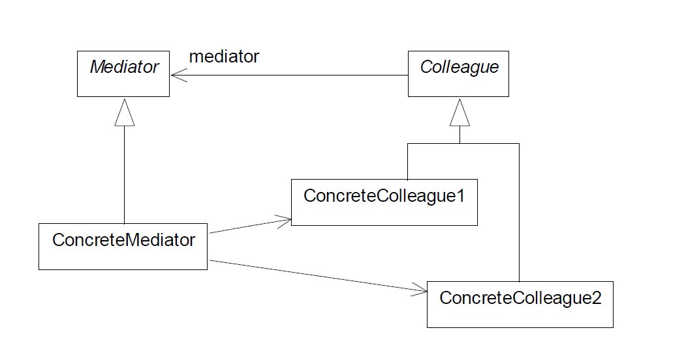

# Лабораторная работа №3: Паттерн «Посетитель» (Visitor)

## Предметная область: Escape From Stash

Игра в жанре «инвентарное выживание», вдохновлённая Escape from Tarkov.
Игрок управляет схроном (сеткой инвентаря), в который периодически появляется лут.
Необходимо продавать предметы на барахолке, экипировать броню, заряжать оружие
и стрелять по лишнему луту для освобождения места.

**Три условия проигрыша:**
1. HP критической зоны (голова/грудь) ≤ 0
2. Деньги < 0 (не оплачена аренда схрона)
3. Схрон полон при появлении нового лута

---

## 1. Описание проблемы предметной области

В игре существует несколько типов предметов, каждый из которых обладает **уникальной**
логикой использования и продажи:

| Тип | Логика `use()` | Логика `sell()` |
|-----|----------------|-----------------|
| **Weapon** | Вход в режим прицеливания, стрельба по предметам | Цена зависит от `durability / 100` |
| **Consumable** | Восстановление голода (`hunger += calories`) | Цена = `price_per_calorie × calories` |
| **Armor** | Надевается на зону тела (заменяет старую) | Цена = `base × (cur/max) × material_modifier` |
| **Ammo** | Заряжается в совместимое оружие | Цена = `base × tier × stack_size` |

**Проблема:** При традиционном подходе (без паттерна) логика операций `use()` и `sell()`
размещается **внутри каждого класса предмета**. Это приводит к следующим проблемам:

1. **Перегрузка классов обязанностями.** Классы лута
(`Weapon`, `Armor`, ...) должны только хранить данные, но вместо этого они содержат логику продажи, использования, взаимодействия с рынком и игроком.

1. **Необходимость изменения готовых классов.** При добавлении новой операции
(например, «Осмотр», «Ремонт», «Страховка») пришлось бы вносить правки в код каждого существующего класса предмета, хотя эти классы предназначены только для хранения свойств и не должны меняться из-за появления новой логики.

1. **Высокая связанность.** Классы лута получают ссылки на `GameManager`,
`FleaMarketManager`, `Player` — то есть знают о всей архитектуре приложения.

---

## 2. Решение: как используется паттерн Visitor

### Архитектура БЕЗ паттерна (`EscapeFromStashManual/`)

Каждый класс предмета реализует методы `sell()` и `use()` **напрямую**:

```python
# src/models/weapon.py (без паттерна)
class Weapon(Loot):
    def sell(self, market) -> None:
        price = self.base_price * (self.durability / 100.0)
        market.list_item(self, price, 15.0)

    def use(self, game_manager) -> None:
        if self.loaded_ammo <= 0:
            game_manager.log("Нет патронов!")
            return
        game_manager.enter_targeting_mode(self)
```

```python
# src/models/armor.py (без паттерна)
class Armor(Loot):
    def sell(self, market) -> None:
        durability_ratio = self.current_durability / self.max_durability
        price = self.base_price * durability_ratio * self.material_modifier
        market.list_item(self, price, 8.0)

    def use(self, game_manager) -> None:
        player = game_manager.player
        for zone in self.zones:
            old_armor = player.get_equipped_armor(zone)
            if old_armor is not None:
                # ... логика замены брони ...
        player.equip_armor(self, self.zones[0])
```

### Архитектура С паттерном Visitor (`EscapeFromStash/`)

Классы предметов остаются **чистыми контейнерами данных**. Операции вынесены
в отдельные классы-посетители:

```python
# src/models/loot.py (с паттерном)
class Loot(ABC):
    @abstractmethod
    def accept(self, visitor: 'Visitor') -> None:
        pass

# src/models/weapon.py (с паттерном)
class Weapon(Loot):
    def accept(self, visitor: 'Visitor') -> None:
        visitor.visit_weapon(self)  
```

```python
# src/visitors/sell_visitor.py
class SellVisitor(Visitor):
    def visit_weapon(self, weapon: Weapon) -> None:
        price = weapon.base_price * (weapon.durability / 100.0)
        self._market.list_item(weapon, price, 15.0)

    def visit_consumable(self, consumable: Consumable) -> None:
        price = 150.0 * consumable.calories
        self._market.list_item(consumable, price, 3.0)
```

```python
# src/visitors/use_visitor.py
class UseVisitor(Visitor):
    def __init__(self, player, stash, market, log_fn, flash_fn, ...):
        ...

    def visit_weapon(self, weapon: Weapon) -> None:
        if weapon.loaded_ammo <= 0:
            self._flash("Нет патронов!", "warn")
            return
        self._start_targeting(weapon)
```

**Вызов в GameManager:**
```python
# Вместо: item.sell(market) / item.use(self)
item.accept(self.sell_visitor)  # Автоматический выбор нужной формулы
item.accept(self.use_visitor)   # Без единого if/switch
```

### Структура паттерна

| Компонент | Назначение |
|-----------|------------|
| **`Visitor`** (абстрактный) | Определяет `visit_weapon`, `visit_consumable`, `visit_armor`, `visit_ammo` |
| **`SellVisitor`** (конкретный) | Формула цены + время продажи для каждого типа |
| **`UseVisitor`** (конкретный) | Логика использования (голод, броня, стрельба, зарядка) |
| **`Loot`** (абстрактный) | Объявляет `accept(visitor)` |
| **`Weapon`/`Consumable`/...** | Реализуют `accept` -> вызывают нужный `visit_Xxx(self)` |

### Как это работает
```
game_manager.use_item(weapon)
    ↓
weapon.accept(use_visitor)
    ↓
use_visitor.visit_weapon(weapon)  ← Python сам выбирает нужный метод!
```

Никаких `if isinstance(item, Weapon)`, никаких `switch` — всё решает полиморфизм.

---

## 3. Диаграмма классов

Диаграмма классов находится в файле `EscapeFromStash.drawio`.




**Ключевые связи:**
- `GameManager` -> `Player` -> `Stash` 
- `GameManager` -> `FleaMarketManager`
- `Visitor` - - - > `Weapon`, `Consumable`, `Armor`, `Ammo` (зависимость от каждого типа)
- Лут-классы **не знают** о Visitor (только абстрактный интерфейс `accept`)

---

## 4. Вывод: как внедрение паттерна повлияло на работу программы

### Функциональность
Внешне **ничего не изменилось**. Обе версии (`EscapeFromStashManual` и `EscapeFromStash`)
идентичны по поведению: те же механики, тот же UI, те же баланс и условия проигрыша.

### Архитектурные преимущества паттерна

| Критерий | Без Visitor | С Visitor |
|----------|-------------|-----------|
| **Необходимость изменения готовых классов** | При новой операции правим все 4 класса с лутом | Создаём 1 новый класс-посетитель |
| **Перегрузка классов обязанностями** | Классы знают о рынке, игроке, UI | Классы — только данные |
| **Связность** | Высокая (классы с лутом -> менеджеры) | Низкая (посетитель связывает) |

### Когда Visitor оправдан
- Набор классов стабилен (4 типа лута не будут меняться)
- Операции расширяются (сейчас 2, потенциально — осмотр, ремонт, страховка)
- Разделение данных и операций критично для поддерживаемости

### Когда Visitor НЕ стоит применять
- Если типы лута будут часто добавляться (придётся менять Visitor интерфейс)
- Если операций всего 1–2 и они тривиальные

**В данном проекте Visitor полностью оправдан**, так как игра подразумевает
расширение типами предметов и операций, а чистое разделение данных и логики
соответствует принципам ООП.

---

## Структура проекта

```
EscapeFromStash/          ← версия С паттерном Visitor
├── main.py               # Точка входа (Pygame)
├── requirements.txt
├── src/
│   ├── catalog.py        # Каталог всех предметов (цены, размеры)
│   ├── models/           # Классы данных (Loot, Weapon, ...)
│   ├── visitors/         # SellVisitor, UseVisitor
│   ├── managers/         # Player, Stash, FleaMarket, GameManager
│   └── ui/               # Renderer (Pygame)
└── assets/images/        # Спрайты предметов

EscapeFromStashManual/    ← версия БЕЗ паттерна
├── main.py               # Точка входа (идентична)
├── requirements.txt
├── src/
│   ├── catalog.py        # (тот же файл)
│   ├── models/           # Классы с встроенными use()/sell()
│   ├── managers/         # (тот же GameManager, без Visitor)
│   └── ui/               # (тот же Renderer)
└── assets/images/        # (те же спрайты)
```

Для запуска:
```bash
cd lab03/EscapeFromStash
pip install -r requirements.txt
python main.py
```
