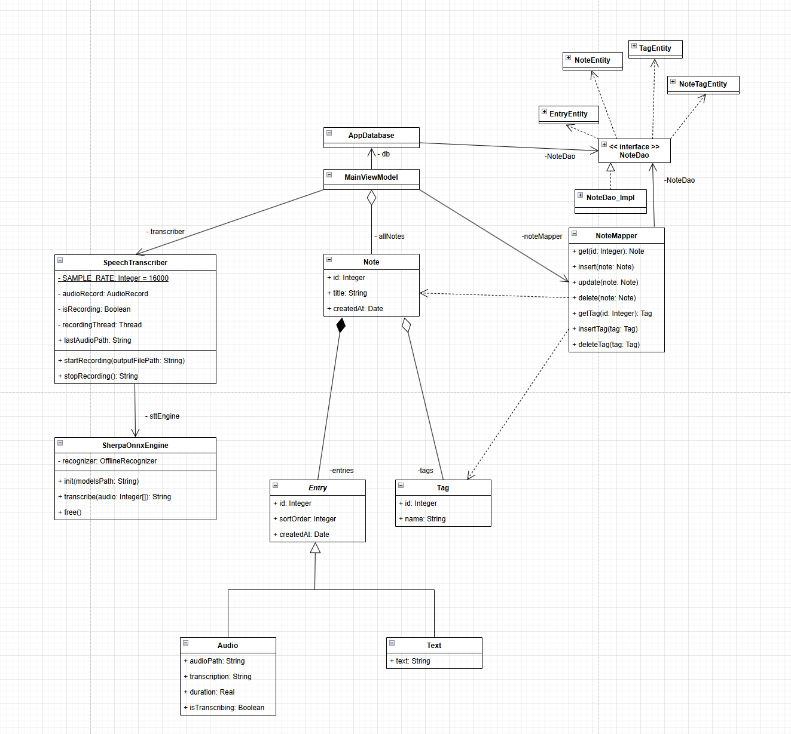
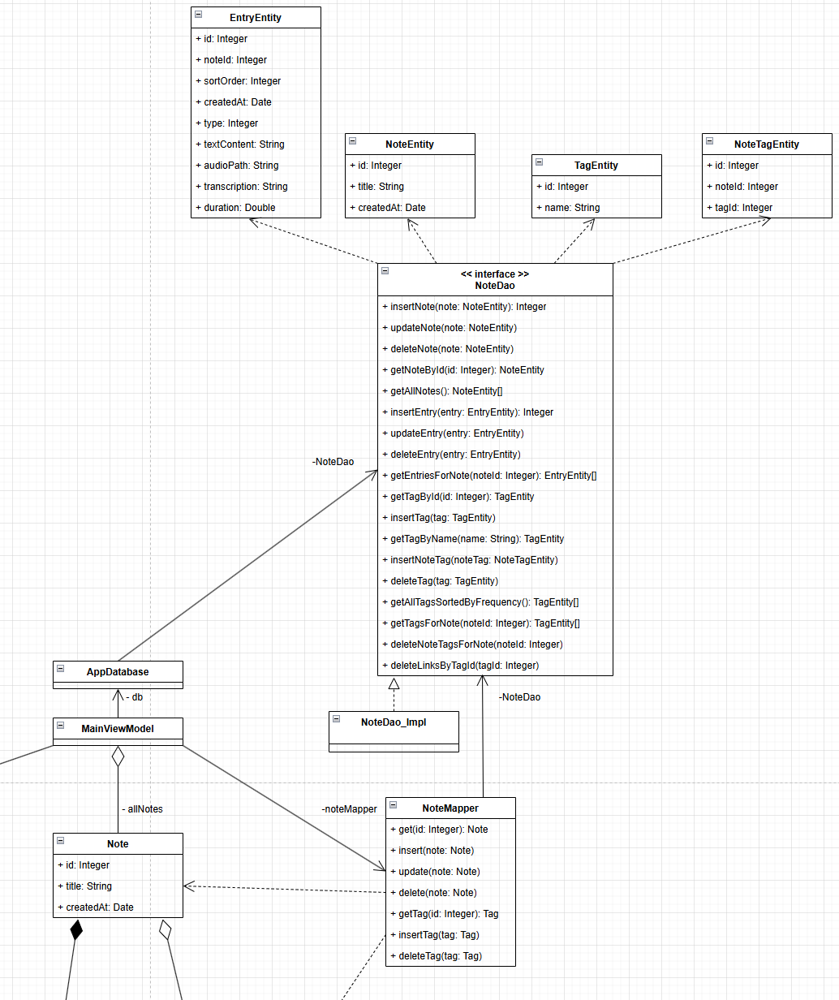

# Документация проекта Notify: Применение паттерна проектирования

## 1. Описание проблемы предметной области
При разработке приложения для заметок **Notify** возникла проблема жесткой связанности между слоем хранения данных и бизнес-логикой приложения.

**Основные сложности:**
* **Разные структуры данных:** Объекты базы данных (`NoteEntity`, `EntryEntity`) оптимизированы для хранения и связей SQL, в то время как доменные объекты (`Note`, `Entry`) спроектированы для удобства работы бизнес-логики и UI (например, использование полиморфизма для разных типов записей — текст и аудио).
* **Высокая связанность ViewModel и слоя работы с данными:** Без специального слоя ViewModel приходится брать на себя задачу трансформации данных, что делает код трудночитаемым и сложным для тестирования.
* **Сложность синхронизации:** При обновлении сложной заметки с вложенными списками записей и тегов требуется сложная логика сопоставления ID, удаления старых записей и вставки новых.

---

## 2. Решение: Паттерн Data Mapper
Для решения этих проблем был применен паттерн **Mapper (Data Mapper)**.

**Как паттерн используется в проекте:**
* **Разделение ответственности:** Создан отдельный класс `NoteMapper`, который инкапсулирует в себе всю логику перекладывания данных из Entity-объектов в Domain-объекты и обратно. Таким образом, устанавливает взаимодействие между двумя независимыми друг от друга подсистемами.
* **Слой абстракции:** `MainViewModel` больше не знает о существовании `NoteEntity` или о том, как устроены таблицы в БД. Она работает исключительно с объектами `Note`, `Entry` и `Tag`.
* **Инкапсуляция SQL-логики:** Вся специфика работы с Room (DAO, транзакции) скрыта внутри маппера. Например, при сохранении заметки маппер сам проверяет, какие записи нужно обновить, а какие удалить из БД.

---

## 3. Диаграмма классов (Архитектура с паттерном)

**Пояснение к структуре:**
1.  Классы `Note`, `Entry` (TextEntry, AudioEntry), `Tag`. Не зависят от БД.
2.  `NoteEntity`, `EntryEntity`, `TagEntity`, `NoteDao`. Отражают структуру таблиц, NoteDao инкапсулирует доступ к БД.
3.  Класс `NoteMapper` служит "мостом" между Data Layer и Domain Layer.
4.  `MainViewModel`, которая координирует системы: создаёт Note, Entry, Tag, в том числе, с помощью SpeechTranscriber, использует `NoteMapper` для получения и сохранения данных, их отображения в UI.

---

## 4. Вывод: Влияние паттерна на работу программы
Внедрение паттерна **Mapper** оказало следующее влияние:

1.  **Чистота архитектуры:** Мы добились четкого разделения слоев. Изменение схемы базы данных теперь требует правок только в Entity и Mapper, не затрагивая бизнес-логику и UI.
2.  **Упрощение ViewModel:** Вместо сотен строк ручного копирования полей из одного объекта в другой, вызываются лаконичные методы `mapper.get(id)` или `mapper.update(note)`.
3.  **Гибкость:** Стало проще реализовать сложные функции, такие как автоматическое сохранение (autosave) и корректная обработка аудио-вложений, так как логика синхронизации состояния объекта с БД вынесена в отдельный тестируемый модуль.
4.  **Облегчение расширения функционала:** При добавлении новых типов записей (например, списки задач или изображения) достаточно расширить преобразователь, не переписывая логику взаимодействия с БД во всем приложении.